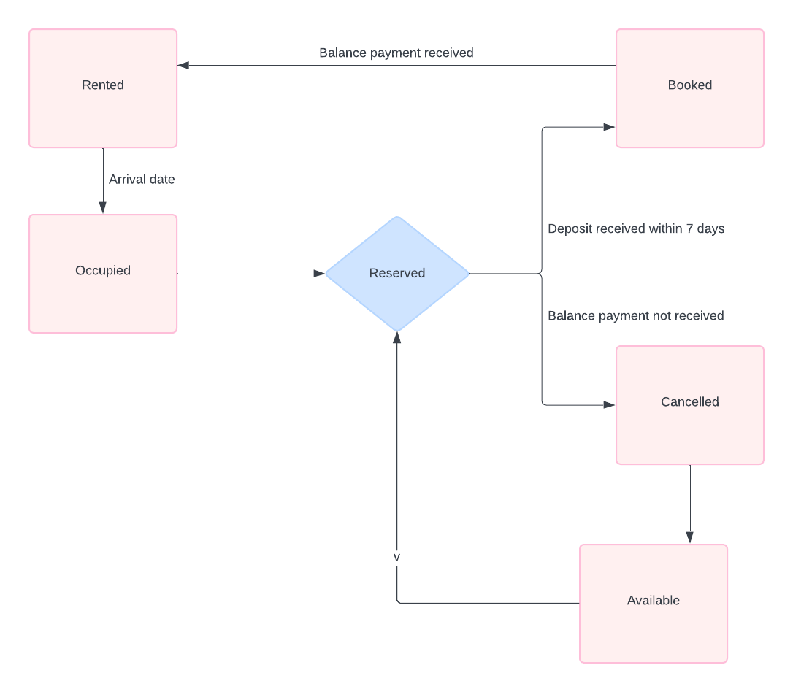
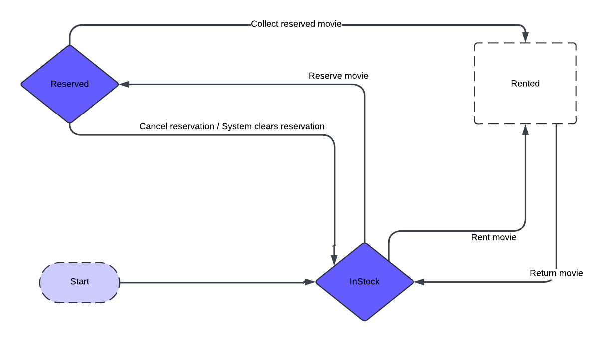

# Black Box Tests -- Part II

Designing test cases using State Transition Diagrams

## Question 1 (2.5 pts)

You own a small resort of summer cottages and ask a local software
developer to create a reservation system you can use to manage bookings.
Before accepting the software you test it thoroughly.

You have 20 cottages that you refer to as #1, #2 ... #20 and operate the
resort for 12 weeks over the months of June, July and
August.

Weekly rental for each cottage is \$1000 per week. The rental period is
from noon on a Sunday to noon on the following Saturday. You clean and
prepare for the next customer each Saturday afternoon and Sunday
morning.

Assume all customers stay one week.

For each of the 20 cottages and each of the 12 weeks, the use cases may
occur.\
**Big hint:** the states of a reservation are shown in bold.

Use cases:

- To start, the reservation system marks all cottages as **available** for all weeks.

- Customers may contact you by phone or email to ask about availability, prices and the like.

  - The system lets you add information about potential customers to your mailing list.

- A customer contacts you by phone or email to reserve a cottage or a certain week.

- If the requested cottage and/or week are not available, you suggest alternatives.

- When you and the customer agree on a cottage and week, and the system lets you indicate that the cottage is **reserved**.

- Upon reserving, the customer must send you a deposit of \$250 if the arrival date is more three weeks ahead.

- If the deposit arrives within seven days, the cottage is marked as **booked**.

- If the deposit does not arrive within seven days, the system cancels the reservation and the cottage becomes **available** for rental to another customer.

- Full payment is due three weeks before the arrival date. That means a customer who reserved with a deposit of \$250 must pay the balance of \$750 at least 21 days before arriving. A customer who books late (less than 21 days before arriving) must pay the full amount of \$1000 within seven days of reserving.

- When the balance of rental payment arrives, the system lets you mark the cottage as **rented**.

- If the balance of rental payment does not arrive 21 days before the arrival date:

  - The system cancels the booking and the cottage becomes **available**.

  - You keep the deposit (if the customer paid it).

- A customer may cancel a reservation or booking.

- The system lets you indicate the cottage is **available** again.

- If the customer cancels more than 3 months (90 days) before the arrival date, you return all money paid - deposit and balance of payment (if paid).

- If the customer cancels between 3 months and 3 weeks of the arrival date (89-21 days) you keep the deposit and return the balance of payment (if paid).

- If the customer cancels within 20 days of the arrival date, you keep all money paid.

- On the arrival date, the cottage becomes **occupied**.

- If the customer does not turn up, you honour the booking anyway, in case the customer arrives late.

# Q1 (2.5 pts) Draw a state transition diagram for a reservation or booking record

Consider that the diagram is the same for all 20 cottages and all 12
weeks, but shows the state of a booking for one cottage and one week.

**Hint:** Include only use case details that relate to a change of
state.

**Diagram**

### States

1. **Available**: The cottage is available for reservation.

2. **Reserved**: A customer has requested to reserve the cottage.

3. **Booked**: The deposit has been received and the reservation is confirmed.

4. **Rented**: Full payment has been received, and the cottage is ready for the customer\'s arrival.

5. **Occupied**: The customer has arrived and is occupying the cottage.

6. **Cancelled**: The reservation or booking has been cancelled.

### Transitions and use case analysis

- **Available to Reserved**

  - **Trigger**: Customer requests reservation.

  - **Condition**: Cottage and week are available.

  - **Use Case**: Customer contacts to inquire about availability and prices. Reservation system marks the cottage as reserved when the customer agrees.

- **Reserved to Booked**

  - **Trigger**: Deposit of \$250 received within 7 days.

  - **Condition**: Reservation is made more than 3 weeks ahead.

  - **Use Case**: Upon reserving, the customer sends a deposit. If received within 7 days, the system marks the cottage as booked.

- **Reserved to Available**

  - **Trigger**: Deposit not received within 7 days.

  - **Condition**: Reservation is made more than 3 weeks ahead.

  - **Use Case**: If the deposit does not arrive within 7 days, the system cancels the reservation and makes the cottage available again.

- **Booked to Rented**

  - **Trigger**: Balance payment received.

  - **Condition**: 21 days before arrival or full payment within 7 days of late booking.

  - **Use Case**: Full payment is due 3 weeks before the arrival date. If the balance is paid, the system marks the cottage as rented.

- **Booked to Available**

  - **Trigger**: Balance payment not received.

  - **Condition**: 21 days before arrival.

  - **Use Case**: If the balance payment is not received 21 days before arrival, the system cancels the booking and makes the cottage available. The deposit is kept.

- **Reserved to Rented**

  - **Trigger**: Full payment received within 7 days.

  - **Condition**: Reservation is made less than 3 weeks ahead.

  - **Use Case**: A customer who books late must pay the full amount within 7 days. If received, the system marks the cottage as rented.

- **Any state to Cancelled**

  - **Trigger**: Customer cancels reservation or booking.

  - **Condition**: Depends on timing of cancellation.

  - **Use Case**: Customer may cancel at any time. The system marks the cottage as available and handles refunds based on timing (more than 90 days, 89-21 days, within 20 days).

- **Rented to Available**

  - **Trigger**: Customer cancels reservation within 20 days of arrival.

  - **Condition**: You keep all money paid.

  - **Use Case**: If the customer cancels within 20 days of arrival, the system marks the cottage as available and retains all payments.

- **Rented to Occupied**

  - **Trigger**: Customer arrives.

  - **Condition**: Arrival date.

  - **Use Case**: On the arrival date, the system marks the cottage as occupied.

- **Any state to Available**

  - **Trigger**: Customer cancels reservation.

  - **Condition**: Different refund conditions apply based on timing.

  - **Use Case**: If the customer cancels, the system marks the cottage as available and processes refunds accordingly.

**Diagram:**

**Question 2 (7.5 pts)**

CC Video store rents movies. You are testing the IT system that
maintains the inventory of movies, customers, rentals and reservations.

CC Video rents movies by the day, for a fee of \$5. All rentals are for
one day and the customer pays before taking the movie out of the shop.

Returns are due by 6 pm on the next day. Customers return movies by
handing the rented copy to staff or dropping it into in a return box.
The late fee is \$6.00 for every day or part day overdue. Except for
high demand movies, the store usually waves the fee for returns just a
few hours late.

All customers are members. Joining is free, but involves showing ID. The
IT system assigns a member number and then uses member number together
with last name and phone number to verify identity. All members in good
standing (with no unpaid fines) can rent movies.

Members can also reserve movies to be picked after 6 pm on the same day.
The store must keep enough copies on reserve to satisfy all
reservations.

Use Cases / Requirements

A.  **A member rents a movie with no reservation.** Staff do the
    following:

- Validate that the customer is a member

- Check for outstanding fines. The member must pay all fines before renting.

- Check that a copy is in stock and available for rental.

- Take payment and give the member a copy of the movie.

- Add a loan record to the system.

B.  **A member returns a movie** Staff do the following:

- Check whether the return is late.

  - If the return is late and the customer is present, waive the fine or make the member pay.

  - If the return is late and the customer is not present, use the system to add the fine to the member's record.

- Remove the loan record from the system.

- Return the copy of the movie to available stock.

C.  **A member reserves a movie.** Staff do the following:

- Validate that the customer is a member.

- Check that an unreserved copy is in stock.

- Record that a copy of the movie is reserved. If two or more members reserve the same movie, the store must put more than one copy on reserve.

D.  **A member rents (collects) a reserved movie.** Staff do the
    following:

- Validate that the customer is a member who made the reservation.

- Check for outstanding fines. The member must pay all fines before renting.

- Check that a copy is in stock.

  - If a copy is in stock and reserved by this member, clear the reservation record.

  - If there is no copy in stock but one is reserved by this member, apologize to the member and note a glitch in the system.

- Take payment and give the member a copy of the movie.

- Add a loan record to the system.

E.  **A Member cancels a reservation.** Staff do the following:

- Validate that the customer is a member who made the reservation.

- Locate the reservation record and clear it

F.  **Automatic system action:**
 At the end of each business day, the system checks for reservations for that day that were not converted to rentals and automatically clears them.

**Instructions**
 Complete the following about changes in state that occur while this application is running.\ \ **Hints:**

- Make up a database schema (in reality you would probably ask the developers):

- What database tables are required for the application?

- When are rows added or deleted and what columns in those tables change as the use case scenarios unfold?

# Q2.a ) List the type of objects that have changing state (1 pts)

- Movie Copy

- Member

- Reservation

- Loan Record

# Q2. b) Draw state diagrams for each of the object types you identified above. (2.5 pts)

 **Hints:**

- You need one diagram for each type of object. Some diagrams may be very simple, but draw them anyway for this exercise.

- Do not draw the diagram the flow of use cases or scenarios. Individual steps in different use cases may change the state of one object. State transition diagrams cut across use case scenarios.

- Label each diagram by naming the type of object. For example, one diagram will show the states of a **copy of a movie**.

Movie Copy:

Member:

Reservation:

Loan Record:

# Q2.c) Identify criteria and define a test case to verify correct handling for four different state transitions. For example, two test cases are listed here. Add four more (1 pts each). (4 pts)

1. Test case:
 **Criteria**: Member in good standing can rent a movie (no reservation required).

**Preconditions**: Member 13 has no fines. Five copies of \"Jaws\" are available.
**Action**: Member 13 rents \"Jaws\".
**Expected Result**: One less copy of \"Jaws\" is available. A loan record for \"Jaws\" exists for member 13.

2. Test case: At the end of each day, the system clears reservations.
 **Criteria**: Reservations for the day are canceled by the system if the member does not collect the movie by end of the business day.

**Precondition**: A copy of \"Jaws\" is on reserve for Member 108.
**Action**: The video store closes for the day.
**Expected Result**: After the system cleanup, the reservation record for Member 108 to collect "Jaws" is deleted and the copy of "Jaws" is available.

3. Test case:
 **Criteria**: In case of late return, fine is added.

**Preconditions**: Member 22 has rented \"Avatar\". The movie is not returned by 6 pm the next day.
**Action**: Member 22 returns \"Avatar\" at 9 am the day after it was due.
**Expected Result**: A fine of \$6 is added to Member 22\'s record.

4. Test case:
 **Criteria**: Member with outstanding fines cannot rent a movie.

**Preconditions**: Member 99 has an unpaid fine.
**Action**: Member 99 attempts to rent \"Titanic\".
**Expected Result**: The system prevents Member 99 from renting \"Titanic\" and prompts for fine payment.

5. Test case:
 **Criteria**: Waive fine for returns a few hours late.

**Preconditions**: Member 45 has rented \"Inception\". The movie is not returned by 6 pm the next day.
**Action**: Member 45 returns \"Inception\" at 7 pm the same day it was due.
**Expected Result**: No fine is added to Member 45\'s record.

6. Test case:
 **Criteria**: Member can cancel a reservation.

**Preconditions**: Member 77 has reserved \"The Matrix\".
**Action**: Member 77 cancels the reservation.
**Expected Result**: The reservation record for \"The Matrix\" is deleted, and the copy is available for others.
